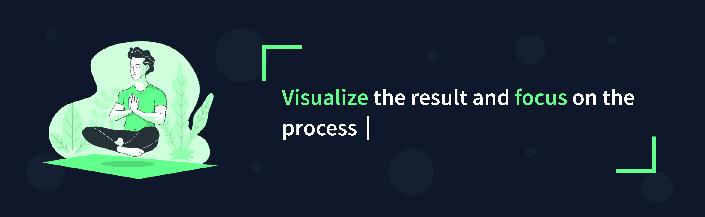

<h1 align="center">Hi 👋, I'M Daniel Arcos</h1>
<h3 align="center">💻 Frontend Developer & Tech Lover</h3>

### 🚀 About me

- 🌱 My knowledge is focused on **Vue**, **Laravel**, **JavaScript**, **PHP**, **Nuxt** and **MySQL**.

- 💡 Passionate about creating fluid, optimized, and visually compelling web experiences.

- 🔭 I love working as a team, learning every day, and providing creative solutions to big ideas.

- ⚡ Interested in continuously improving my skills and exploring new technologies such as Node.js, TypeScript, Next and Express.

- 📚 Always looking for challenges that allow me to grow professionally and personally.

- ⚡ Fun fact: I know something is wrong with the project when everything compiles on the first try. 😏

- 📫 **Contact me:** [danielestebanarcos.pro@gmail.com](mailto:danielestebanarcos.pro@gmail.com)

### 🛠 Technologies and tools

  
  
  
  
  
  
  
  
  
  
  
  
  
  
  
  
  
  

### 📌 Portfolio

### 📊 GitHub Statistics

  
  

### 📬 Connect with me

  
  
  
  

